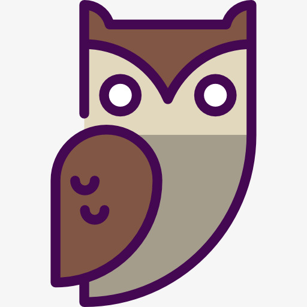

# BackTalker

A virtual assistant that is developed in Python and Slack API

[Reference is here](https://www.fullstackpython.com/blog/build-first-slack-bot-python.html)

[2nd Reference is here](https://medium.com/@adakaminkure/how-and-why-i-build-a-bot-for-slack-in-python-de862cd91e21)